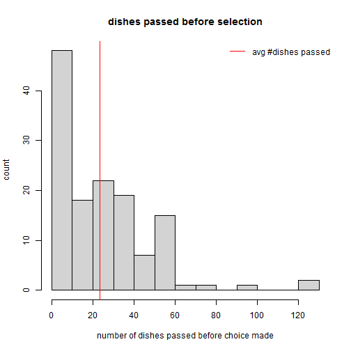

We ate at the [Sakura Kaiten](https://www.google.com.au/maps/place/Sakura+Kaiten+Sushi/@-37.812989,144.971679,15z/data=!4m2!3m1!1s0x0:0x90ab3fbe0265fb4b) sushi restaurant on Friday.  It's almost a clich&eacute; that nerds like trains, so eating at a restaurant that delivers a continuous stream of delights through a rotary conveyor belt is a particular joy.  I couldn't help myself, though. When V. remarked that she was waiting for her favourite crispy crab to come around, I started wondering about the analytics of the sushi train.

So, you've got people sitting around this rotating stream of little dishes, and everybody just takes the dish that they want the most at that moment. Or they wait to see if what they want will appear shortly.  The chefs continuously replace dishes that have been taken -- and add the occasional new and different dish.  What are the chances that you'll wait more than one rotation and not see your favourite?

So, let's create a vector of seat positions and assign some dishes to them. We'll also maintain a list of which person (on the seat) is currently eating.  At the start, nobody is eating yet.  For simplicity, I will start with five seats and 10 dishes.


```r
	# seats and dishes
	nSeats <- 5			# number of seats
	nDishes <- 10		# number of dishes
	dishes <- 1:nDishes # ready dishes
	
	# start with preferred dishes in front of seats
	xdish <- 1:nSeats
	seats <- dishes[xdish]			 # give dishes to seat
	dishes[xdish] <- -dishes[xdish]  # dishes not ready anymore
	
	# who is eating?
	eating <- rep(0,nSeats)
	eatTime <- nSeats				# eating time is one cycle
```

Now, every diner has preferences for the dishes.  Let's for the moment say that everybody starts with the same general preferences, indicated by the dish number -- one for most preferred, two for next preferred, and so on.  However, once a dish has been sampled, its preference drops to last. So, we have a rotating preference list per seat. 


```r
	# dish preference matrix
	prefs <- t(matrix(1:nDishes,nrow=nDishes,ncol=nSeats))
	
	# rotate a vector of e.g. preferences
	rotvec <- function(x){ c(x[2:length(x)],x[1])}
```

Now, at each turn, if the dish in front of the seat matches the first preference for that seat, we take it and rotate our preference. We then shift the dishes along the seats. The chef sits at seat one. When a "taken" dish arrives, the chef will replace it, if a matching dish is ready.  Otherwise, the chef will let the taken dish pass, but will prepare a matching dish for the next time the taken dish comes around. Making a dish takes time, so we'll keep track of that as well. For simplicity, we'll measure duration in terms of the number of dishes that pass -- so a "cycle" is the length of the train (i.e. the number of seats).

If a seat has taken a dish, it goes into eating mode and will skip the next $n$ dishes that pass by. On the other hand, if the dish in front of the seat doesn't match our first preference, then we wait for the next dish (and increase our count of the numnber of dishes that passed before we got our choice). We reseat the count if we take a dish.


```r
	# count of dishes passed for each seat
	passed <- rep(0,nSeats)		# for each seat how long have we waited?
	genpassed <- c()			# in general, how long do we wait?
	making <- rep(0,nDishes)    # which dishes are we making?
	makeTime <- nSeats			# making a dish takes one cycle
	
	
	# process one turn 
	turn <- function(){
		# at chef's seat
		if(seats[1] < 0){ # there's eaten dish
			x <- which(dishes == -seats[1])
			if(length(x)>0){ # there's a replacement ready
				seats[1] <<- -seats[1]
				dishes[x[1]] <<- -dishes[x[1]]
				making[x[1]] <<- makeTime
			} else {	# there's no replacement ready
				x <- which(dishes == seats[1])
				if(length(x)>0)	{
					if(making[x[1]] > 0) making[x[1]] <<- making[x[1]] -1
					else dishes[x[1]] <<- -dishes[x[1]]
				}
			}
		} else {	# no eaten dish, but prep replacements
			x <- which(dishes < 0)
			if(length(x)>0){	# there is a dish to prep
				if(making[x[1]] > 0) making[x[1]] <<- making[x[1]] -1
				else dishes[x[1]] <<- -dishes[x[1]]
			} else {		# no dish to prep, but replace one
				x <- prefs[1,1]
				prefs[1,] <<- rotvec(prefs[1,])
				seats[1] <<- dishes[x]
				dishes[x] <<- -dishes[x]
			}
		}
		
		# at diners' seats
		for(i in 2:nSeats){
			if(eating[i]==0){
				if(seats[i] == prefs[i,1]){	# yeah! preference is here
					seats[i] <<- -seats[i]
					prefs[i,] <<- rotvec(prefs[i,])
					genpassed <<- c(genpassed,passed[i])
					passed[i] <<- 0
					eating[i] <<- eatTime
				} else {					# pass: not preference
					passed[i] <<- passed[i] + 1
				}
			} else {	# we're eating: count it down
				eating[i] <<- eating[i] -1 
			}
		}
		
		# rotate the dishes through the seats
		seats <<- rotvec(seats)
	}
```

For the small number of diners and dishes, the cycle isn't very long. If we simulate a large number of turns, we would see that, on average, you would expect to wait a little bit less than one cycle to get your preferred dish.  That changes quickly as the number of seats increases.

 
