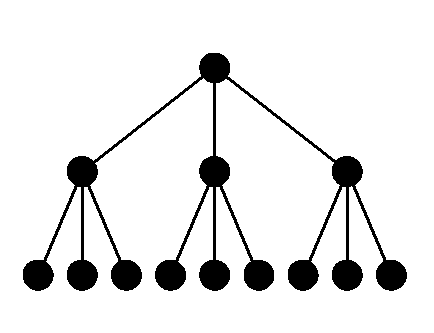
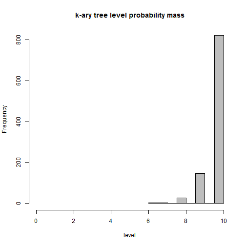

On the weekend, I ran into a problem that needed a probability distribution that I hadn't seen before.  I googled around, but couldn't find any implementation of what I needed.  It's probably out there, somewhere on page umpteen of the search results, but I figured it was a good opportunity to implement a custom distribution in R.

The context is a hierarchy, like an area of business operations, with processes that are hierarchically organised.  That is, the bottom level is the processing of transactions, but then there are higher level processes that affect the transaction process.  For example, setting fees across groups of transactions.  Then there are even higher level processes, say, setting the criteria for market segments, within which we might have different groups of fees.

Now imagine that events can happen across the area at random.  That means sometimes the event will touch a transaction at the bottom level, but sometimes at a higher level.  If the event occurs at a higher level, then that will affect multiple transactions at the bottom level.  So, what I want to know is, what is the probability that an event will happen at a particular level, and how many bottom level transactions will be affected by that event?

A simple model with a fixed number of lower level transactions enables us to calculate the probability that a given number of transactions are affected.  
<figure>
<center>

<figcaption>*Figure 1. Simple process hierarchy as a k-ary tree. Bottom nodes are individual transactions affected.*</figcaption>
</center>
</figure>

Using the *diagram* package [@Soetaert2009], I have drawn a [Hasse](http://en.wikipedia.org/wiki/Hasse_diagram) diagram in *Figure 1* of a small example hierarchy of 13 possible events, some of which are higher level, which means they affect multiple lower-level transactions. In this example, it's easy to see that there are 4 possible events where more than a single transaction is affected. This type of hierarchy is called an [k-ary tree](http://en.wikipedia.org/wiki/K-ary_tree). For the purpose of estimating the number of transactions affected by a higher level event, we can turn the tree into a a probability function.

A convenient form of the probability function is the probability that a node is on a particular level, given a fixed group size (the number of nodes belonging to a direct parent node) and the maximum number of levels. To derive the probability mass function, we use the formula that calculates the total number of nodes in the tree (N), where $L$ is the maximum level, starting from zero at the top node, and $g$ is the group size:

$$
N = f(L,g) =
	\sum^{L}_{i=0} g^i = \frac{g^{L+1} - 1}{g-1}, \quad L,g,i \in \mathbb{N}_0, g>1
$$

Each node on a level other than the last level is a tree in itself. So, the number of end-nodes that a node on a given level $i$ will reach is calculated as $g^{L-i}$, and the probability that a node is on level $i$ is given by the following probability mass function (PMF):

$$
Pr(i;L,g) = \frac{1}{N}g^i = \frac{g^i(g-1)}{g^{L+1}-1}, \quad i<=L
$$

The corresponding cumulative distribution function (CDF) is:

$$
Pr(i<=n;L,g) = \frac{1}{N}\sum_{i=0}^n g^i = \frac{g^{n+1}-1}{g^{L+1}-1}
$$


The full set of probability functions for the k-ary levels can be coded in R as follows:


```r
# k-ary tree level probability functions (without error checks)
dkaryl <- function(i,L,g) (g^i * (g-1)) / (g^(L+1) -1)
pkaryl <- function(n,L,g) (g^(n+1) -1) / (g^(L+1) -1)
qkaryl <- function(q,L,g) floor((log(q*(g^(L+1)-1)+1)-log(g))/log(g))
rkaryl <- function(n,L,g) sample(0:L,n,replace=TRUE,prob=dkaryl(0:L,L,g))
```
Note that the probability functions range over the number of levels in a tree, which may not be all that many.  The following example draws a histogram for a tree with 10 levels and groups of 5.
<figure>

```r
x <- rkaryl(1e3,10,5)
hist(x,main="k-ary tree level probability mass",
	 xlab="level",col="grey",xlim=c(0,10))
```

 
<figcaption>*Figure 2. histogram of k-ary level probability density with max level of 10 and groups of 5.*
</figcaption>
</figure>


*Bibliography*
