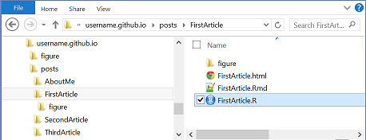

When I started blogging about analytics (and R), I went looking for a blogging platform that would allow me to easily post directly from R-markdown.  However, the typical choices like Wordpress didn't work well in that regard.  I still had to copy, paste and edit the posts, because neither the markdown nor html features from extended markdown were well supported.

The solution pointed in the direction of "static blog generators".  These (re-)generate the blog as a set of ordinary html pages, which can then be hosted on places like [GitHub](https://github.com/).  This means that you can just generate a html page from an R-markdown page, with something like [pandoc](http://johnmacfarlane.net/pandoc/), save it in a folder, and sync the blog page with the host site.  Writing a blog becomes almost seamless with writing some literate R.

I couldn't find a simple blog generator written in R, so I wrote one.

So, this rather long blog documents a mini blog generator, written completely in R.  The individual blog pages can be standalone html documents, like those generated by [knitr](http://yihui.name/knitr/) and pandoc from R-markdown text.  Each blog post consists of a folder that contains the html page, with a sub-folder for any graphics.  The folder may also contain other files, which are ignored by the blog, but enables the folder to be a complete project folder, such as generated by [RStudio](http://www.rstudio.com/).  The only restriction is the naming convention that the folder has the same name (minus extension) as the html page that contains the posting.  So, an example structure of folders and files might be as follows:

<figure>

<br>
<figcaption>*Figure 1: example folder structure for the blog*</figcaption>
</figure>

In the example, the top folder[^1] is called `username.github.io`. That is what you would choose for the top folder name, if you hosted your site using GitHub. That is, when you create an account on GitHub, you would also create a repository named *username.github.io*[^2] to host your blog, and that would automatically create a local folder by that name. If you do not host on GitHub, you may call the (local) folder anything you like.

The top folder also contains one essential file: `index.html`.  This is just a straightforward html file, without any special "micro-templating" or "macros".  The miniblog generator that I'll describe later simply updates this file whenever changes are made in the folders containing posts.  Moreover, the generator only touches specific sections of the html, so you're free to get creative with the other parts of the html.  That way, you can style the layout of the blog site as you please.

One part that the blog generator changes in the html is the `iframe` that contains the front page article. This section looks like the following:

<pre><code>
	&lt;!-- front page article -->
	&lt;iframe name="frontpost" class="frontpost" scrolling="auto" 
	frameborder="NO" src="posts/FirstArticle/FirstArticle.html">&lt;/iframe>
</code></pre>

The generator replaces the `src` content to the html file of the last article that was updated. Similarly, the generator replaces the links `<a...` links in the following section:

<pre><code>
	&lt;!-- links to articles -->
	&lt;div class="articles">
	
	&lt;a href="posts/FirstArticle/FirstArticle.html"
	target="frontpost">FirstArticle&lt;/a>&lt;br>
	
	&lt;a href="posts/SecondArticle/SecondArticle.html"
	target="frontpost">SecondArticle&lt;/a>&lt;br>
	...
	...
	&lt;/div>
</code></pre> 

That's it as far as the blog structure is concerned.  An index.html file in the top folder and a sub-folder called "posts" that in turn contains a folder for each article. Articles are just html files that can be produced from something like an R-markdown text.

Now, onto the R-code that generates the blog site. Firstly, we require the XML libraries to handle the html files.

```{r libraries}
require("XML",quietly=TRUE)
require("selectr",quietly=TRUE)
```

Next is the function that "re-indexes" the front page.  By that I mean, we want to scan all the articles in the `posts` folder and create the links for them in the `index.html` page.  We also want to update the link for the front page article.  The list of article links will be in order of last update. 

The first parameter of the reindex function is the path to the top folder -- that is, the folder where `index.html' lives.  In our example above, that might be something like `c:/GitHub/username.github.io/`.  The next parameter is the base URL that you would put in a browser to visit the blog -- for example, `http://username.github.io/`. The last parameter allows you to pass a metadata list -- more about that later.

```{r reindex}
# recreate index.html with updated article list
# assumes the path points to a folder structure
# that adheres to the miniblog naming convention
reindex <- function(path="./",base="",meta=NA){
	docpath <- paste(path,"index.html",sep="")

	if(file.exists(docpath)){
		doc <- htmlParse(docpath)

		# get sorted article metadata
	if(typeof(meta)!="list") 
		meta <- as.data.frame(
			metadata(paste(path,"posts/",sep=""),
					 paste(base,"posts/",sep="")
			)
		)
		p <- order(meta$mdate,decreasing=TRUE)

		# replace links to articles
		articles <- querySelector(doc,"div .articles")
		removeNodes(xmlChildren(articles))
		for(i in p){
			a <- newXMLNode("a", newXMLTextNode(meta$post[i]), attrs=c(
					href= paste("posts/",meta$relpath[i],sep=""),
					target="frontpost"
					)
				 )
			addChildren(articles,a)
			addChildren(articles,newXMLNode("br"))
		}
		
		# repoint front page article
		f <- querySelector(doc,".frontpost")
		removeAttributes(f,.attrs="src")
		addAttributes(f,src=paste("posts/",meta$relpath[p[1]],sep=""))
	} else warning(paste("Index file does not exist: ", docpath,sep=""))
	return(doc)
}
```
The function that gathers all the information about the articles is called `metadata()`.  It gets a list of all the article folders in `posts` and then loops through them.  In each folder it sucks in the html document and gathers all the meta data fields in the html header. It also checks the last modification date of the file, so that we can sort later by "latest update".  Finally, we also include the entire body of the html page, which is the content of the article.   That's where the most processing happens, because we have to replace the local image links with a full http reference, so that the content can stand alone from the location we gathered it from.  Due to the transformations by the XML library functions, we also have to clean various special characters.

```{r metadata}
# function to read metadata from posts
metadata <- function(path="./",base=""){
	# create a structure to hold info
	meta <- list(post="", relpath="", mdate=0, title="", 
				 author="",date="", description="", keywords="",
				 content="")
				
	# get list of post html files
	dirs <- list.dirs(path,recursive=FALSE,full.names=FALSE)
	postpaths <- paste(dirs,"/",dirs,".html",sep='')
	postfullpaths <- paste(path,postpaths,sep='')
	
	# extract meta data from each file
	for(i in 1:length(postfullpaths)){
		if(file.exists(postfullpaths[i])){
			meta$post[i] <- dirs[i]
			meta$relpath[i] <- postpaths[i]
			meta$mdate[i] <- file.info(postfullpaths[i])$mtime 
			doc <- htmlParse(postfullpaths[i])
			absolurl(doc,base=paste(base,dirs[i],"/",sep=""))
			xvalue <- querySelector(doc,"title")
			if(!is.null(xvalue)) meta$title[i] <- xmlValue(xvalue)
			meta$author[i] <- metaval(doc,"author")
			meta$date[i] <- metaval(doc,"date")
			meta$description[i] <- metaval(doc,"description")
			meta$keywords[i] <- metaval(doc,"keywords")
			
			# extract a clean-ish copy of the content
			body <- toString.XMLNode(querySelector(doc,"body"))
			body <- substr(body,7,nchar(body)-8)
			body <- gsub("&#13;","",body)
			body <- gsub("\x92","'",body)
			body <- gsub("[\x93-\x94]",'"',body)
			body <- gsub("\x96",'&mdash;',body)
			body <- gsub("\x85",'&#8230;',body)
			body <- gsub("[\x7f-\xff]",' ',body)
			g <- regexpr("<!--DISQUS",body)[1] - 1
			if(g>0) body <- substr(body,1,g)
			meta$content[i] <- body
		}
	}
	return(meta)	
}
```

The metadata function uses a special helper function for obtaining the value of a metadata field. That's shown below.

```{r metavalue}
# get a single metadata value
metaval <- function(xdoc,meta){
			r <- ""
			xvalue <- querySelector(xdoc,paste("meta[name=",meta,"]",sep=""))
			if(!is.null(xvalue)) r <- xmlGetAttr(xvalue,"content",default="")
			return(r)
}
```

The metadata function also grabs the content of the html page, which anticipates that we might want to generate an rss feed.  However, the contents may contain relative links, for example to images.  These links neeed to be made into absolute urls (i.e with full http path). The function below takes care of the main links. Essentially, it prefixes the base URL to the relative link in the attribute of the html tag.

```{r absolurl}
# convert links in an xml node like <body> to 
# absolute references, using a base url
absolurl <- function(xml,base=""){
	if(substr(base,nchar(base),nchar(base)) != "/") 
		base <- paste(base,"/",sep="")

	# expand and link (stylesheet) references
	links <- querySelectorAll(xml,"link")
	for(i in links){
		link <- xmlGetAttr(i,"href",default="")
		if(link != "" & substr(link,1,4) != "http"){
			removeAttributes(i,.attrs="href")
			addAttributes(i,href=paste(base,link,sep=""))
		}
	}

	# expand img links to absolute references
	imgs <- querySelectorAll(xml,"img")
	for(i in imgs){
		link <- xmlGetAttr(i,"src",default="")
		if(link != "" & substr(link,1,4) != "http"){
			removeAttributes(i,.attrs="src")
			addAttributes(i,src=paste(base,link,sep=""))
		}
	}
	
	# expand a a-links that do not have https or # prefix
	anchors <- querySelectorAll(xml,"a")
	for(i in anchors){
		link <- xmlGetAttr(i,"href",default="")
		if(link != "" & substr(link,1,4) != "http" 
		   & substr(link,1,1) !="#"){
			removeAttributes(i,.attrs="href")
			addAttributes(i,src=paste(base,link,sep=""))
		}
	}
}
```

Once we have all the meta-data, it's relatively simple to generate an rss xml file. To take care of the xml pre-amble, we'll just read a template file (or an existing rss file if it exists).  Then, for each item in the meta data list, we'll generate an xml node called `<item>`, which is how rss stores the article data.  Note that if the metadata isn't passed as a parameter, then we construct it within the `rssupdate` function, using the `path` and `base` parameters. This gives some flexibility to use the `rssupdate` function standalone, or as part of a larger process where we don't want to duplicate reading the metadata.

Finally, the `rssupdate` function also allows for a rudimentary filtering on a keyword. This is useful if you want to create an rss feed for articles that contain a specific keyword. For example, if you put "R-code" as a keyword in your articles that contain R, you can then create a feed for [R-bloggers](http://www.r-bloggers.com/).

```{r rssupdate}
# create rss feed
rssupdate <- function(filename,meta=NA,path=NA,base="",keyword=NA){
	# get sorted post metadata
	if(typeof(meta)!="list") 
		meta <- metadata(paste(path,"posts/",sep=""),base=base)
	meta <- as.data.frame(meta)
	if(!is.na(keyword)) p <- which(grepl(keyword,meta$keywords))
	else p <- 1:nrow(meta)
	
	# rss preamble
	doc <- xmlParse(paste(path,filename,sep=""))
	url <- xmlValue(querySelector(doc,"link"))
	if(substr(url,nchar(url),nchar(url)) != "/") url <- paste(url,"/",sep="")
	
	channel <- xmlParent(querySelector(doc,"item"))
	removeNodes(querySelectorAll(doc,"item"))
	
	# create new item nodes
	for(i in p){
		a <- newXMLNode("item")
		title <- newXMLNode("title", newXMLTextNode(meta$title[i]))
		link <- newXMLNode("link", newXMLTextNode(
			paste(url,"posts/",meta$relpath[i],sep="")
		))
		guid <- newXMLNode("guid", newXMLTextNode(
			paste(url,"posts/",meta$relpath[i],sep="")
		))
		pubDate <- newXMLNode("pubDate", newXMLTextNode(
			format(as.POSIXct(meta$date[i]),"%a, %d %b %Y %H:%M:%S %z")
		))
		description <- newXMLNode("description", newXMLTextNode(
			meta$description[i]
		))
		content <- newXMLNode("content:encoded", 
			newXMLTextNode(meta$content[i], cdata=TRUE
		))
		addChildren(channel,a)
		addChildren(a,kids = 
			list(title,link,guid,pubDate,description,content)
		)
	}
	return(doc)
}
```

Finally, we use all the functions above in a "blog update" function.  The function rewrites the `index.html` page and creates rss files. 

```{r blogupdate}
# rewrite the index.html page of the blog
# incl. making a backup copy 
blogupdate <- function(path="./",base=""){
	curdir <- getwd()
	setwd(path)
	file.copy(from="index.html",to="index.html.old",overwrite=TRUE)
	meta <- metadata(path="posts/",base=paste(base,"posts/",sep=""))
	doc <- reindex(path,meta=meta)
	saveXML(doc,"index.html")
	saveXML(rssupdate("template.xml",path=path,meta=meta),"all.xml")
	saveXML(rssupdate("template.xml",path=path,keyword="R-code",meta=meta),"rcode.xml")
	setwd(curdir)	
}
```

That's it -- just create literate R articles in folders underneath the `posts` folder and run the `blogupdate` function. You then need to sync your files with the host site and that depends on where you're hosting your blog.  If it is on GitHub then just use the relevant `git` command like "push" (or on Windows, the `sync` button).


[^1]: I'm using Windows terminology of "folders" here, of course meaning "directories" for nix fans.

[^2]: where *username* is your GitHub username.